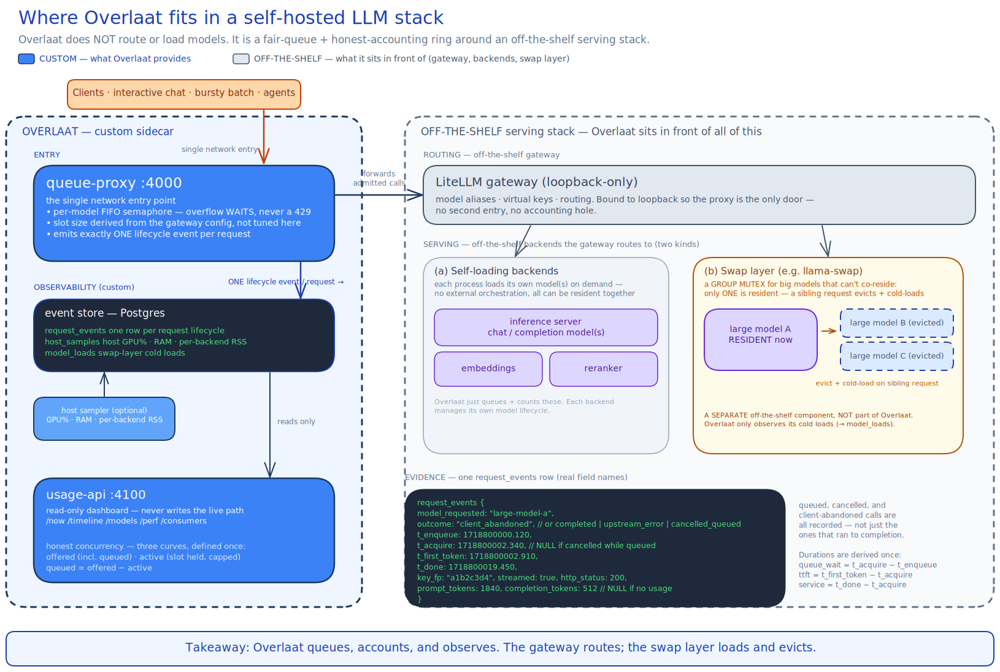
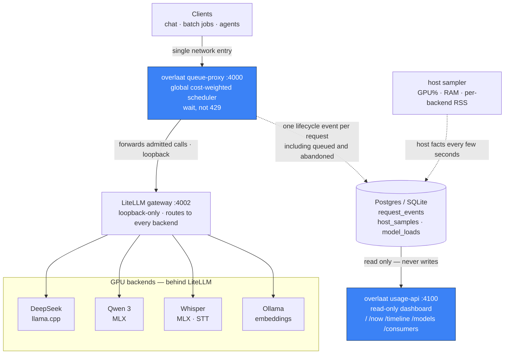

# Overlaat

[](https://pypi.org/project/overlaat/)
[](https://github.com/tdamsma/overlaat/actions/workflows/ci.yml)
[](https://pypi.org/project/overlaat/)
[](LICENSE)

A **fair waiting-queue** and **honest usage accounting** sidecar in front of a self-hosted,
multi-backend LLM gateway ([LiteLLM](https://github.com/BerriAI/litellm)). Two small services
plus one database schema — nothing more.

Built for one case: a **Mac Studio (or similar Apple-Silicon box) as a small trusted team's
personal compute server** — a few models behind one gateway, mixed interactive chat and bursty
batch, on one trusted network where API keys are *attribution*, not secrets. It is **not** a
load balancer, multi-tenant billing, or an analytics stack.

*Overlaat* is Dutch for a controlled spillway: when requests outrun your backends the excess
pools in a fair queue and drains in order, instead of a `429`-cascade tearing through every
caller's retry loop.



## Why

Share one box between people and agents and two things hurt:

1. **Overflow is a cliff, not a queue.** LiteLLM's `max_parallel_requests` (and swap-layer
   limits) *reject* on overflow with `429` rather than make the caller wait — so every caller
   has to grow its own backoff loop.
2. **Insert-on-completion logging lies by omission.** It only writes rows for calls that *ran
   to completion*. Queued calls, client-abandoned calls, and long calls still in flight are
   invisible — so you can't answer "what was happening on the box at 14:03".

Overlaat fills the gap between "Ollama on a laptop" (no queueing/accounting) and an enterprise
gateway (more machinery than a personal box should run): fair queueing and truthful attribution
with minimal machinery.

## What it is

A sidecar in *front* of LiteLLM, plus a read-only dashboard:

- **queue-proxy** (`:4000`) — the single network entry point. Every request is admitted through
  one **global cost-weighted priority scheduler** (see below); slot sizes derive from your
  backend config. Being the one component on the full call path, it is also the one
  instrumentation site: it emits **exactly one lifecycle event per request** to the DB —
  including queued and client-abandoned calls that insert-on-completion logging misses.
- **usage-api** (`:4100`) — a read-only FastAPI dashboard over those events. Never writes;
  restart it independently of the proxy.

**One principle: instrument the call path once, derive everything else.** The proxy writes one
honest row per request, the optional host sampler writes host facts every few seconds, the
dashboard is pure query — no second source of truth, no survivor bias.

## Architecture



**Keep LiteLLM bound to loopback** — that is what makes the proxy the *only* entry point and
therefore the single, complete instrumentation site. A second door into the gateway is a hole
in your accounting.

## Quickstart

You need a database — a reachable **Postgres** (the one LiteLLM uses is fine; the default) or,
for a single box, a local **SQLite** file — and a LiteLLM gateway on loopback.

```bash
# 1. Install
uv pip install overlaat                          # or, for a project: uv add overlaat

# 2. Init the schema (idempotent; works for Postgres AND SQLite)
python -m overlaat.db init "$DATABASE_URL"       # or, Postgres-native: psql "$DATABASE_URL" -f schema.sql

# 3. Configure
cp examples/overlaat.env.example overlaat.env && chmod 600 overlaat.env   # holds DB credentials
cp examples/litellm-config.example.yaml litellm-config.yaml               # your model list
cp examples/run-queue-proxy.sh examples/run-usage-api.sh .

# 4. Run the two services (behind a supervisor of your choice)
OVERLAAT_ENV=./overlaat.env ./run-queue-proxy.sh   # :4000 entry, in front of LiteLLM
OVERLAAT_ENV=./overlaat.env ./run-usage-api.sh     # :4100 read-only dashboard
```

Point clients at `:4000` instead of LiteLLM; open `http://your-host:4100/` for the dashboard.
The proxy derives concurrency per model from `litellm-config.yaml`, so that file is the **single
source of truth for concurrency**.

**Single-process rule.** The proxy runs **one uvicorn worker on purpose** — the in-memory budget
ledger, per-model in-flight counts, FIFO ordering, and event writer all live in that one
process. **Never run it with `--workers N`**; sharding defeats both scheduling and accounting.
Restart the proxy only when its queue is empty (`/__queue/status`); a restart drops queued calls.

**SQLite (single-box alternative).** Set `DATABASE_URL=sqlite:///./overlaat.db` and init with
`python -m overlaat.db init "$DATABASE_URL"` — no separate DB service. It works because the proxy
is the only writer and SQLite runs in WAL mode, so the dashboard reads alongside it without
blocking. WAL writes two sidecar files (`-wal`, `-shm`); back up live with
`sqlite3 overlaat.db ".backup backup.db"` (never copy the file by hand). Postgres stays the
default and the choice for any shared/multi-host setup.

**Dev install.** `uv pip install -e '.[dev]'` — editable + pytest, ruff, build, twine. Releases
are git-tag based (`hatch-vcs`): push a `vX.Y.Z` tag.

## Honest concurrency: three curves

The dashboard never invents a concurrency number. From `request_events` it derives, per model at
any time *t*, exactly three series:

| curve | definition |
|---|---|
| **offered** | `t_enqueue ≤ t < t_done` — everything in the system, including still-queued |
| **active** | `t_acquire ≤ t < t_done` — occupying a backend slot, bounded by the cap *by definition* |
| **queued** | offered − active |

Throughput-vs-concurrency buckets each completed call on the time-weighted average `active(t)`
over its own `[acquire, done]` interval; cells with too few samples are marked insufficient and
never drawn as a trend. If the data isn't there, the dashboard says so.

See [`docs/OBSERVABILITY.md`](docs/OBSERVABILITY.md) for the curves and caveats, and
[`docs/ARCHITECTURE.md`](docs/ARCHITECTURE.md) for the call-path and instrumentation design.

## Capacity-aware priority scheduler

*On by default since 0.0.3.* Independent per-model FIFO semaphores let caps sum freely — two
models can each be "under cap" while collectively oversubscribing the single GPU. Instead,
Overlaat runs **one global priority queue with cost-weighted admission against a shared GPU
budget** `B = 1.0`.

Each run costs its GPU fraction (`cost = 1/cap`, so a `cap=4` model costs `0.25`). The scheduler
admits the highest-priority request that *fits* the remaining budget and releases that cost on
completion — so models run **in parallel up to real capacity**, not the sum of caps. Admission
requires both `model_in_flight < cap` **and** `used + cost ≤ B`. Packing is **work-conserving**
(leftover budget keeps serving cheap jobs) with **eager reservation + aging** so a drip of cheap
high-priority jobs can't starve an expensive one. **Large-model switching** falls out for free: a
swap-slot ("fat-slot") group where one big model is resident at a time is modeled as `cost = 1.0`,
so admitting one fills the budget and blocks the rest. **Per-key priority** is un-gameable:
`effective_priority = min(requested, key_ceiling) + aging`. There is **no preemption** — Metal
can't reorder dispatched kernels, so admission is the only lever.

The trade: a shared budget gives **lower peak concurrency** than summed caps but is **honest
about the one GPU and free of thrash**, keeping the "wait, don't reject" posture. With the
scheduler on but nothing configured (`cost = 1/cap`, `B = 1.0`, equal priority, aging off), a
single model reduces to exactly the old per-model FIFO semaphore. Full design (packing policy,
starvation argument, scalar-cost VRAM-vs-compute caveat):
[`docs/COST-SCHEDULER.md`](docs/COST-SCHEDULER.md).

`OVERLAAT_SCHEDULER=off` is a kill-switch restoring the per-model `asyncio.Semaphore` FIFO path.
All knobs are optional; defaults reduce to FIFO for a single model.

| env var | default | meaning |
|---|---|---|
| `OVERLAAT_SCHEDULER` | `on` | `off` = kill-switch, restore per-model FIFO |
| `OVERLAAT_BUDGET` | `1.0` | shared budget `B` (the whole GPU); caps summed cost of all in-flight runs |
| `OVERLAAT_DEFAULT_COST` | `1.0` | cost for a model with no declared cap (so it isn't silently uncounted) |
| `OVERLAAT_DEFAULT_PRIORITY` | `0` | priority when neither request nor key supplies one; also the fallback ceiling |
| `OVERLAAT_AGING_RATE` | `0.0` | linear priority gain per second waited (`0.0` = aging off → pure FIFO at equal priority) |
| `OVERLAAT_RESERVATION_GRACE` | `0.0` | reservation is eager (`0.0`); non-zero reserved for future refinement |

Per-model knobs come from the LiteLLM config's `model_info` block (next to the model, like
`max_parallel_requests`):

- **`model_info.overlaat_cost: <float>`** — explicit GPU-fraction cost override; beats `1/cap`.
- **`model_info.overlaat_slot: <group>`** — swap-slot group; every member's cost is forced to
  `1.0`, so the "one big model at a time" mutex falls out of the budget arithmetic with no lock.

Per-key priority ceiling comes from **LiteLLM key metadata**, not an env map: the
`LiteLLM_VerificationToken` row's `metadata` JSON, integer field **`overlaat_priority`**. Cached
in memory and refreshed ~every 60 s (never read on the hot path); falls back to
`OVERLAAT_DEFAULT_PRIORITY` when absent or the table is unreachable (e.g. a SQLite single-box
deployment). A client sets per-request urgency with a `priority` integer in the request body,
clamped to the key's ceiling — a batch key can't impersonate an interactive one.

Admission decisions are recorded on each event: `request_events` carries `priority`, `cost`, and
`wait_reason` (`none|reserved|aged_in|budget_full|model_cap`; NULL when the scheduler is off).

> Note: large-model switching is performed by the underlying swap layer (e.g. llama-swap);
> Overlaat only **observes and logs** it (`model_loads`) and folds it into budget arithmetic via
> `overlaat_slot`.

## Status and caveats

- **Experimental, MIT** ([`LICENSE`](LICENSE)). Shared as-is — **no support promise**, no
  cross-version compatibility guarantee.
- **Backend-agnostic.** Built and dogfooded on Apple-Silicon multi-backend, but all it needs is
  an OpenAI-compatible LiteLLM gateway in front and a Postgres or SQLite to write events to.
- **Built with strong LLM assistance** (Claude, and the local models it queues), humans leading
  ideas, architecture, testing, and debugging — said openly because it shaped the work. If you're
  not happy with AI-assisted code, this isn't for you. Read the code before you rely on it.

Known caveats, stated up front:

- **Per-process GPU is not reliably measurable** on all platforms — Metal/MLX on macOS reports 0.
  GPU% is kept host-wide; **memory is attributed per-backend via RSS**.
- **Token counts are NULL** when a backend reports no `usage`. The proxy injects
  `stream_options.include_usage=true` on streaming chat to minimize this; NULL is never counted
  as zero.
- **Engine tail after client-abandon.** On disconnect the slot releases at `t_done`, but a
  single-stream engine may keep decoding briefly. The "active" curve measures *slot occupancy*,
  not literal GPU-busy after release. In-flight requests are therefore **not** safely cancellable;
  only still-queued ones are.

## Acknowledgements

Overlaat is a thin layer on top of: [LiteLLM](https://github.com/BerriAI/litellm) (the gateway);
[FastAPI](https://fastapi.tiangolo.com/) / [Starlette](https://www.starlette.io/) /
[uvicorn](https://www.uvicorn.org/) (the two services); [httpx](https://www.python-httpx.org/)
(streaming pass-through); [psycopg](https://www.psycopg.org/) /
[PostgreSQL](https://www.postgresql.org/) (the event store); and the local-inference ecosystem it
queues — [MLX](https://github.com/ml-explore/mlx), [llama.cpp](https://github.com/ggml-org/llama.cpp),
[Ollama](https://github.com/ollama/ollama), [vLLM](https://github.com/vllm-project/vllm),
[llama-swap](https://github.com/mostlygeek/llama-swap).
