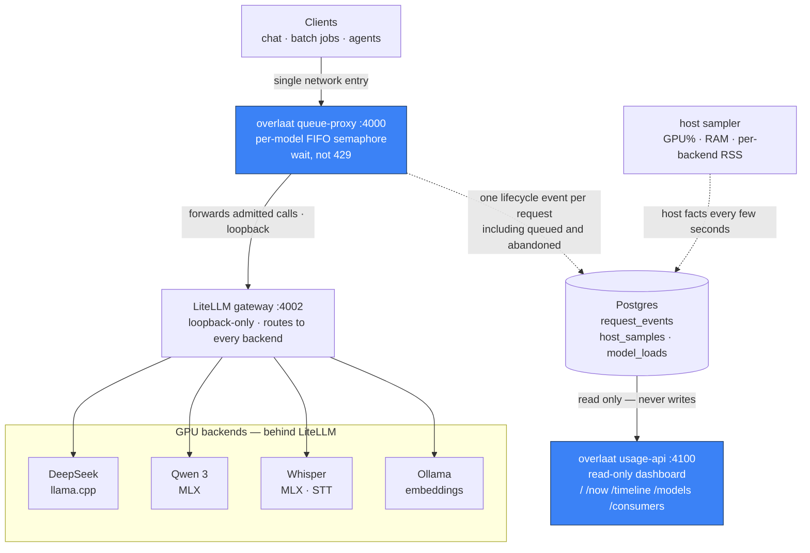

# Overlaat

**A fair waiting-queue and honest usage-accounting sidecar for a self-hosted multi-backend LLM gateway — built around a Mac Studio shared as a small, trusted team's personal compute server.**

*Overlaat* is Dutch for a **controlled spillway** in a dike: it sheds overflow by
design instead of breaching. Same posture toward load — when requests outrun your
backends, the excess pools in a fair FIFO queue and drains in order, rather than a
`429`-cascade tearing through every caller's retry loop.


---

## The problem it solves

You are running a **Mac Studio (or similar big Apple-Silicon box) as a personal compute
server**, shared by a small, trusted team — several models behind a
[LiteLLM](https://github.com/BerriAI/litellm) gateway, a mix of interactive chat and
bursty batch jobs, on one trusted network where API keys are attribution, not secrets.
Two things hurt:

1. **Overflow is a cliff, not a queue.** LiteLLM's `max_parallel_requests` (and any
   swap-layer concurrency limit) *reject* on overflow — they return `429` rather than
   making the caller wait. A burst of parallel jobs against a single-slot model turns
   into a `429`-cascade, and every caller has to grow its own backoff logic.
2. **Usage accounting lies by omission.** Insert-on-completion spend logging only ever
   writes a row for a call that *ran to completion*. Calls that sat queued, calls the
   client abandoned mid-stream, long-running calls still in flight — all invisible.
   You cannot answer "what was actually happening on the box at 14:03" from rows that
   only appear after the fact.

Overlaat sits in the niche between **"Ollama on my laptop"** (no queueing, no
accounting, fine for one user) and **"enterprise gateway with a full analytics stack"**
(more machinery than a small self-hosted setup wants to run). It gives a small team
fair queueing and truthful usage attribution with two small services and one Postgres
table.

---

## What it is

Overlaat is a **sidecar that sits in *front* of LiteLLM**, plus a **read-only usage
dashboard**:

- **queue-proxy** (`:4000`) — the single network entry point. Every request flows
  through here and is FIFO-queued behind a **per-model semaphore**; the slot size for
  each model is *derived* from your backend config, not tuned separately. Because it is
  the one component on the full call path, it is also the one instrumentation site: it
  emits **exactly one lifecycle event per request** to Postgres — *including* queued and
  client-abandoned calls that insert-on-completion logging structurally misses.
- **usage-api** (`:4100`) — a read-only FastAPI dashboard over those events. It never
  writes; it only reads. Restart it freely, independently of the proxy.

The guiding principle: **instrument the call path once, derive everything else.** The
proxy writes one honest row per request; the host sampler writes host facts every few
seconds; the dashboard is pure query.

---

## Architecture



Keep LiteLLM bound to loopback so the proxy is the *only* entry point — and therefore
the single, complete instrumentation site.

---

## Quickstart

You need a reachable Postgres (the same one LiteLLM uses is fine) and a configured
LiteLLM gateway on loopback.

```bash
# 1. Install
pip install -e .        # or: uv pip install -e .

# 2. Apply the schema (idempotent)
psql "$DATABASE_URL" -f schema.sql

# 3. Configure
cp examples/overlaat.env.example overlaat.env          # fill in DATABASE_URL etc.
chmod 600 overlaat.env                                  # it holds DB credentials
cp examples/litellm-config.example.yaml litellm-config.yaml   # your model list
cp examples/run-queue-proxy.sh examples/run-usage-api.sh .    # the two run scripts

# 4. Run the two services (behind a supervisor of your choice)
OVERLAAT_ENV=./overlaat.env ./run-queue-proxy.sh        # :4000 entry, in front of LiteLLM
OVERLAAT_ENV=./overlaat.env ./run-usage-api.sh          # :4100 read-only dashboard
```

Point clients at `:4000` instead of LiteLLM directly. Open `http://your-host:4100/`
for the dashboard. The queue-proxy derives one semaphore per model from
`litellm-config.yaml`, so that file is the single source of truth for concurrency.

> The proxy runs a **single uvicorn worker on purpose**: the in-memory per-model
> semaphores and the instrumentation live in that one process, so FIFO ordering and
> event emission must not be sharded across workers.

---

## Honest concurrency: three curves

The dashboard never invents a concurrency number. From `request_events` it derives, at
any time *t* and per model, exactly three time series: **offered** (`t_enqueue ≤ t <
t_done` — everything in the system, including still-queued), **active** (`t_acquire ≤ t
< t_done` — actually occupying a backend slot, bounded by the cap *by definition*), and
**queued** = offered − active. Throughput-vs-concurrency buckets each completed call on
the time-weighted average `active(t)` over its own `[acquire, done]` interval, and cells
with too few samples are marked insufficient and never shown as a trend.

See [`docs/OBSERVABILITY.md`](docs/OBSERVABILITY.md) for the curves and their caveats,
and [`docs/ARCHITECTURE.md`](docs/ARCHITECTURE.md) for the call-path and instrumentation
design.

---

## Roadmap

- **Capacity-aware priority scheduler** — *not yet implemented.* Today's code runs
  independent **per-model FIFO semaphores**: each model admits up to its own cap, and
  the caps sum freely. That is a fine v1, but it lets two models be individually
  "under cap" while collectively oversubscribing the single GPU.

  The planned next step replaces those independent semaphores with **one global
  priority queue + cost-weighted admission against a single shared GPU budget**
  (`B = 1.0`). Each run costs its fraction of the GPU (`cost = 1 / cap`, so a `cap=4`
  model costs `0.25`); the scheduler admits the highest-priority request that *fits*
  the remaining budget and releases that cost on completion — so multiple models run
  **in parallel up to real capacity** instead of up to the sum of their caps. Packing
  is **work-conserving** (leftover budget keeps serving cheap jobs) with a
  **reservation + aging** guard so a drip of cheap high-priority jobs can't starve an
  expensive one. Backend hard caps still bind (`model_in_flight < cap` **and**
  `used + cost ≤ B`), and **large-model switching** falls out for free: a swap-slot
  ("fat-slot") group where only one big model is resident at a time is modeled as
  `cost = 1.0`, so admitting one fills the budget and blocks the rest until it
  completes. Optional **per-key priority** is un-gameable (`effective_priority =
  min(requested, key_max)`, batch keys capped low). There is **no preemption** —
  Metal can't reorder dispatched GPU kernels, so the only lever is *admission*.

  The trade is deliberate: a shared budget is **lower peak concurrency** than summed
  caps but **honest about the one GPU and free of thrash**, and it keeps the same
  "wait, don't reject" spillway posture. Full design (packing policy, starvation
  proof, the scalar-cost VRAM-vs-compute caveat):
  [`docs/COST-SCHEDULER.md`](docs/COST-SCHEDULER.md).

  > Note: today, large-model switching is performed by the underlying swap layer
  > (e.g. llama-swap); Overlaat only **observes and logs** it (`model_loads`). The
  > scheduler above folds that switching into its own budget arithmetic.

- **Storage-backend agnostic (at least Postgres + SQLite)** — *not yet implemented.*
  Today both writers and the dashboard talk to Postgres directly (`psycopg`). The plan
  is a thin storage abstraction over the three tables so a single-box deployment can
  run on **SQLite** with zero extra services, while a shared/multi-host setup keeps
  **Postgres**. The event schema is intentionally simple (epoch-second timestamps, no
  DB-specific types), so this is mostly an insert/query adapter plus dialect-aware DDL.

---

## Status

- **Experimental.** This is shared as-is. **No support promise**, no compatibility
  guarantee between versions.
- **MIT licensed.** See [`LICENSE`](LICENSE).
- Built and battle-tested on an **Apple-Silicon multi-backend** setup, but it is
  **backend-agnostic**: it only needs an OpenAI-compatible LiteLLM gateway in front of
  whatever engines you run, and a Postgres to write events to.
- **Heavily LLM-assisted.** Large parts of this codebase, its docs, and these comments
  were written with the help of LLMs (and dogfooded against the very gateway this sits
  in front of). The design decisions are human-owned and the code runs in real use, but
  read it with that in mind: review before you rely on it.

### Known caveats (honest by design)

- **Per-process GPU is not reliably measurable** on all platforms — notably
  Metal/MLX workloads on macOS report 0. GPU% is therefore kept host-wide; **memory is
  attributed per-backend via RSS**.
- **Token counts are NULL** when a backend reports no `usage`. The proxy injects
  `stream_options.include_usage=true` on streaming chat to minimize this; NULL is never
  counted as zero.
- **Engine tail after client-abandon.** On disconnect the slot releases at `t_done`,
  but a single-stream engine may keep decoding briefly. The "active" curve measures
  *slot occupancy*, not literal GPU-busy after release. In-flight requests are therefore
  *not* safely cancellable; only still-queued requests are.
